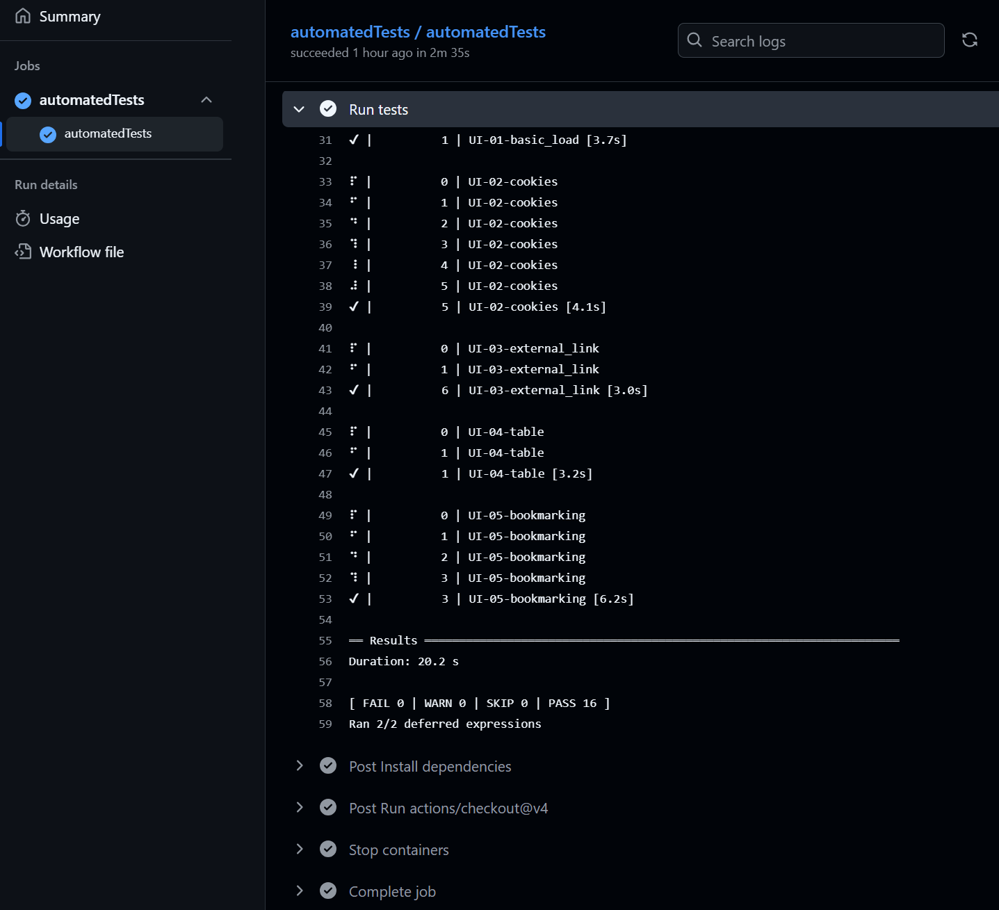

```{r, include = FALSE}
knitr::opts_chunk$set(
  collapse = TRUE,
  comment = "#>"
)
```

We provide several reusable GitHub Actions workflows in dfeshiny. 
These are primarily intended for use with dashboards, but can also be used with 
other projects hosted on GitHub.

The reusable workflows covered in this article are:

- Automated tests
- Lintr
- Pull request Trello card creation

The dashboard deploy reusable workflow is covered separately in the 
[using the dfeshiny deploy template article](using-the-dfeshiny-deploy-template.html).

To implement automated workflows, your repository will require the folder 
**.github/workflows/**. You'll more than likely have this folder, but if not
you'll need to create it.

## Automated tests

The automated-tests reusable workflow triggers GitHub Actions to run 
`shinytest2::test_app()` on your repository code. To enable this, simply copy the following code into a .yaml file in the .github/workflows/ folder of your repository.

```
on:
  push:
    branches:
      - main
  pull_request:

name: Test dashboard

jobs:
  automatedTests:
    uses: dfe-analytical-services/dfeshiny/.github/workflows/automated_tests_template.yaml@main
```

And then add > commit > push to your remote GitHub repository.

Once implemented, this will run `shinytest2` whenever a change is made to a pull request or your main branch on GitHub. The results can be found in the checks section of your pull request and Actions tab of your repository.

Clicking into a given test result will show the steps taken to run the automated tests and under the **Run tests** stage, you can find the results of the tests as shown below.




## Lintr

The lintr reusable workflow triggers GitHub Actions to run 
`lintr::lint_dir()` on your repository code. This will not change any of your code, but will produce recommendations of improvements to code layout and styling. To enable this, simply copy 
[.github/workflows/lintr.yml](https://github.com/dfe-analytical-services/dfeshiny/blob/main/.github/workflows/lintr.yml)
to the .github/workflows/ folder of your repository and then add > commit > 
push to your remote GitHub repository.

Once set up, lintr will run on your code anytime you create or update a pull request and when anything gets merged into main. Results will be added as comments to the relevant pull request where relavent and also available through the GitHub actions tab in the same way as the shinytest2 results above.


## Pull request Trello card creation

### Using the Trello API key and token

This workflow requires authorisation to access the required Trello board. This
can be done at the GitHub organisation level, so requires a 
dfe-analytical-services admin to set up. This is done in the GitHub project 
(e.g. dfe-analytical-services) at Settings > Secrets and
variables > Actions.

If you are setting up this workflow to create a ticket on the Statistics 
Development team's board, then the Trello API key and token should already be
stored under Organization secrets. To give a given repository access to these secrets:

- click the edit symbol alongside each of "TRELLO_API_KEY" and "TRELLO_API_TOKEN"
  - note that if you don't see the edit symbols in the table alongside the above
  entries, you may need to click the "Manage organisation secrets button" if 
  present
- click the settings cog next to the selected repositories dropdown
- find and tick the required repository
- click save changes
- make sure you've done this for both "TRELLO_API_KEY" and "TRELLO_API_TOKEN"

If you need to link to a different board or update the API key and token variables for the Statistics Development board, then refer to the [create a new Trello API key section](#create-a-new-trello-api-key) below.

### Creating the workflow

To implement the workflow, you can copy [.github/workflows/trello.yaml](https://github.com/dfe-analytical-services/dfeshiny/blob/main/.github/workflows/trello.yaml) into your own repository's .github/workflows folder.

#### title-format

  Update the `title-format` to reflect the name of your own repository.

#### api-key and api-token

If the target board is the Statistics development team board, then leave the 
`api-key` and `api-token` variables as is. If directing cards to a different 
board, then you'll likely need to  
[create a new trello api key](#create-a-new-trello-api-key) and update 
TRELLO_API_KEY and TRELLO_API_TOKEN to the corresponding organisation secrets 
for the new board.

#### list-id and label-ids

The list-id and label-ids parameters can then be updated as needed. For the 
statistics development team board the relevant codes are:

- `list-id`:
  - In review: 63ce5064a4859b0387f46b9b
- `label-ids`:
  - New stuff (6): 63ce4ffcbfa825468a8e2a69
  - dfeshiny (9): 67b33b30b7f808294a05b1ab

To identify IDs for other items or on a different board, select a card on your 
Trello board and then add ".json" to the URL in the browser address box. This shows the card info in json format from which you can extract the required IDs 
after a bit of detective work.

### Create a new Trello API key

To link to a new board or replace the key and token for access to the Statistics 
Development team board, you'll first need to create a Trello Power-Up:

- Navigate to the [Trello power ups admin page](https://trello.com/power-ups/admin)
- Click New
- Give the power up a name and provide your e-mail and name, click create
- Navigate to the API key page
- Copy the API key
- Back on GitHub, navigate to Organisation settings > Secrets and
variables > Actions
  - If linking to a new board, click New organisation secret and paste the API key into the Value field. Choose a name for the key e.g. MY_TEAM_TRELLO_API_KEY
  - If refreshing the Statistics development team key, click the edit icon for TRELLO_API_KEY, click enter a new value and paste the API key
- Back on your Trello Power up, click manually generate a **token** (ignore the Secret, this is not needed). 
  - Click Allow and then copy the API token that's generated
- And back to GitHub orgnasation secrets once more...
  - If linking to a new board, click New organisation secret and paste the API token into the Value field. Choose a name for the key e.g. MY_TEAM_TRELLO_API_TOKEN
  - If refreshing the Statistics development team key, click the edit icon for TRELLO_API_TOKEN, click enter a new value and paste the API token

As noted, the API secret is not needed. If you use this in place of the token, you'll get a 401 error when the workflow tries to run.
